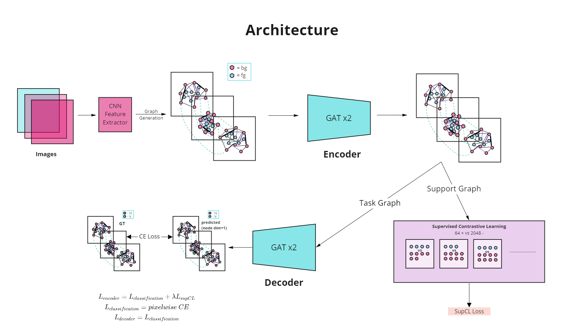

# Pixel GNN

## Semi-supervised Few Shot Segmentation using Node-Level Contrastive Learning in Graphs

We are trying to do pixel-level representation learning using supervised and unsupervised contrastive learning at a node level in graphs.

We are using only 20% labeled data as opposed to the fully supervised setting. Pixel-level features are extracted using CNN-based feature extractors like ResNet. We have made densely connected graphs from the embeddings obtained to encode connectivity (similarity of 2 nodes) in edge features, after connecting a node to all its k-nearest neighbors. 

We have made an end-to-end GNN-based encoder-decoder architecture also including contrastive learning, stochastic graph augmentations, auxiliary losses, and prediction of the few-shot query to improve the representations. The interactions among pixel nodes help to label queries more efficiently. Predictions on the query are done by taking the consensus of all nodes through message passing which is not possible through existing CNN-based approaches.

### Architecture

### Graph Construction for labelled images
To improve our results we optimised 
Support Graph
Sample pixels from the support images. Kept num_fg and num_bg as hyper-parameters.
Pixels Features: [R,G,B,x,y]

Connections between the sampled support pixels (inter-image and intra-image)
1) bg to bg connections are random.
2) fg to fg connections: random/nearest-neighbours.
3) fg to bg connections are random.
Number of each of these connections is also a hyper-parameter. Even the ratio intra/inter-image connections per pixel can be varied.

Edge Features: 3-dimensional (between 2 pixels)
[ f(r2-r1, g2-g1, b2-b1), manhattan_dist (|x2-x1|+|y2-y1|), belong_to_same_image {0/1}]
Task Graph
To the above graph, we add all the query pixels for transductive node classification.
Node and edge features are the same as before.

Connections:
1) Query to query: 4-connected with dilation 
2) Query to support: random